# ShadersForFun

Unity version : 2019.4+
Tested with : Win DX11

| Scene | Image |
| - | - |
| `Stereogram` | 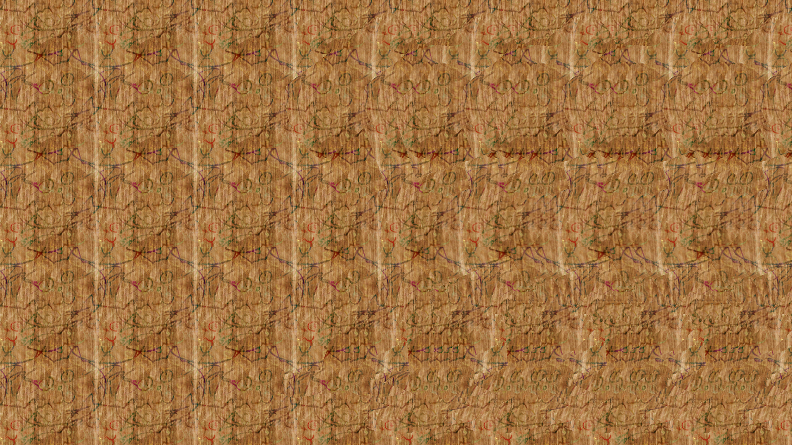 |
| `PrismaticCard` | 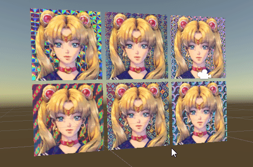 |
| `WaterDrop` | 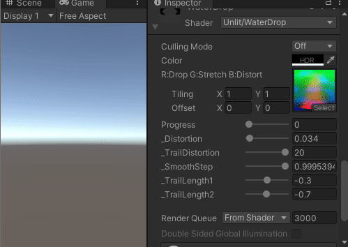 |
| `ImageShading` | 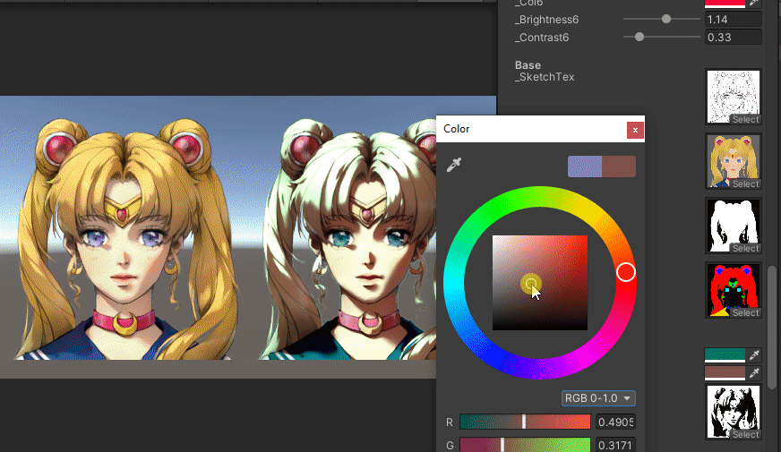 |
| `ParallaxEffect` | 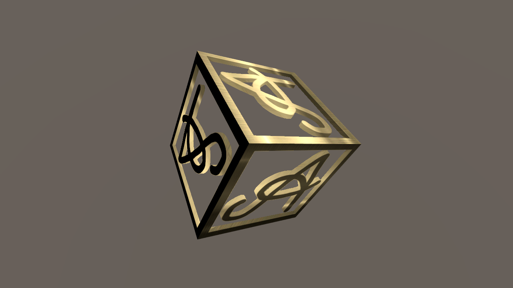 |
| `FillingSphere` | 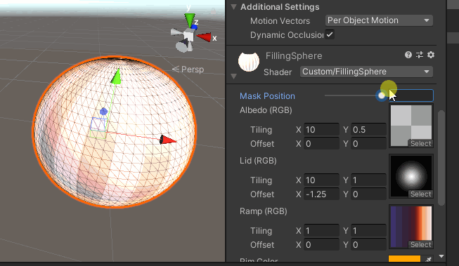 |
| `RadialCircle` | 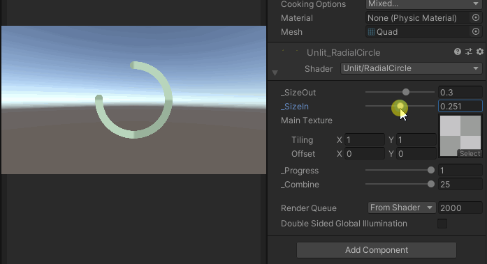 |
| `GeomBuildings` | 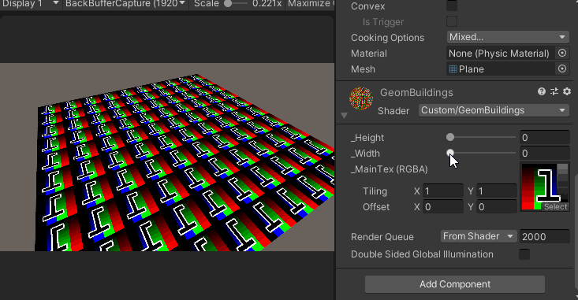 |
| `FacingImage` | 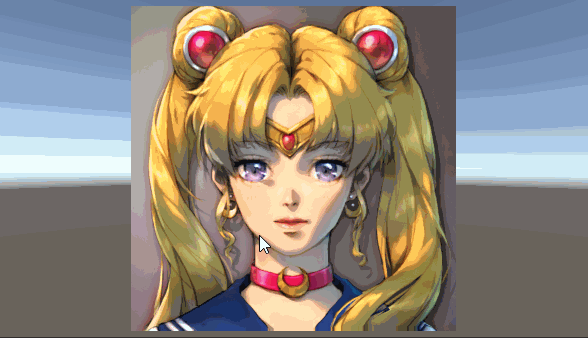 |
| `FakeHalo` | 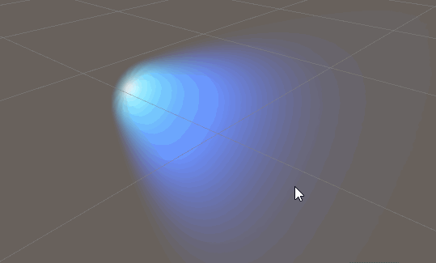 |
| `CutoutTransition` | 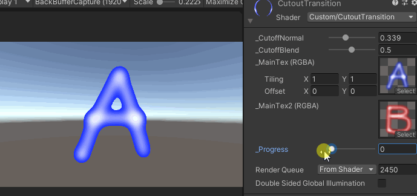 |
| `Shatter` | 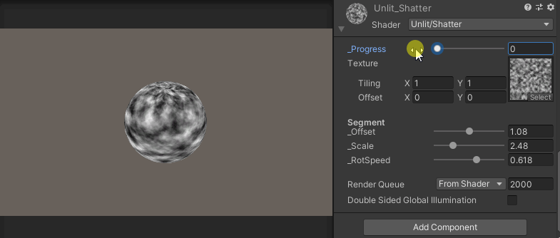 |
| `TessellationTail` | 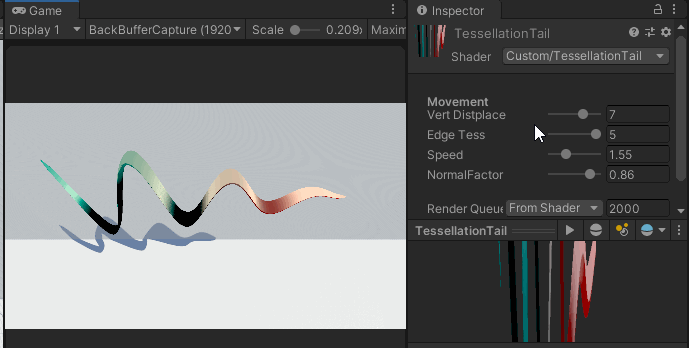 |

-------------

Disclaimer: The stuff here are not optimized. Just for fun.
