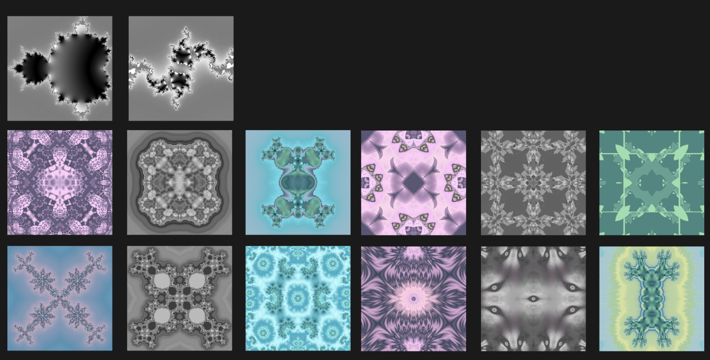

# ShadersForFun

Unity version : 6000.0+ \
Tested with : Win DX11 \

Most shader in this repo works for Built-in RP, and it will also work in older unity versions as Built-in RP didn't change for years. \
Some of these Built-in RP shaders will also work for URP but note that they are not SRP batcher compatible. Need some small work to convert them properly. \
Shaders named with URP/HDRP will only work for URP/HDRP.

| Scene | Image |
| - | - |
| `Stereogram` |  |
| `PrismaticCard` |  |
| `WaterDrop` |  |
| `ImageShading` |  |
| `ParallaxEffect` |  |
| `FillingSphere` |  |
| `RadialCircle` |  |
| `MeshMorph` |  |
| `GeomBuildings` |  |
| `FacingImage` |  |
| `Eye` |  |
| `Raymarching` |  |
| `FakeHalo` |  |
| `Fractal` |  |
| `CutoutTransition` |  |
| `SimpleLighting` |  |
| `BalloonMesh` |  |
| `Shatter` |  |
| `TessellationTail` |  |
| `VertexDot` |  |
| `URPLitBreakdown` |  |
| `HDRPLitBreakdown` |  |

-------------

Disclaimer: The stuff here are not optimized. Just for fun.